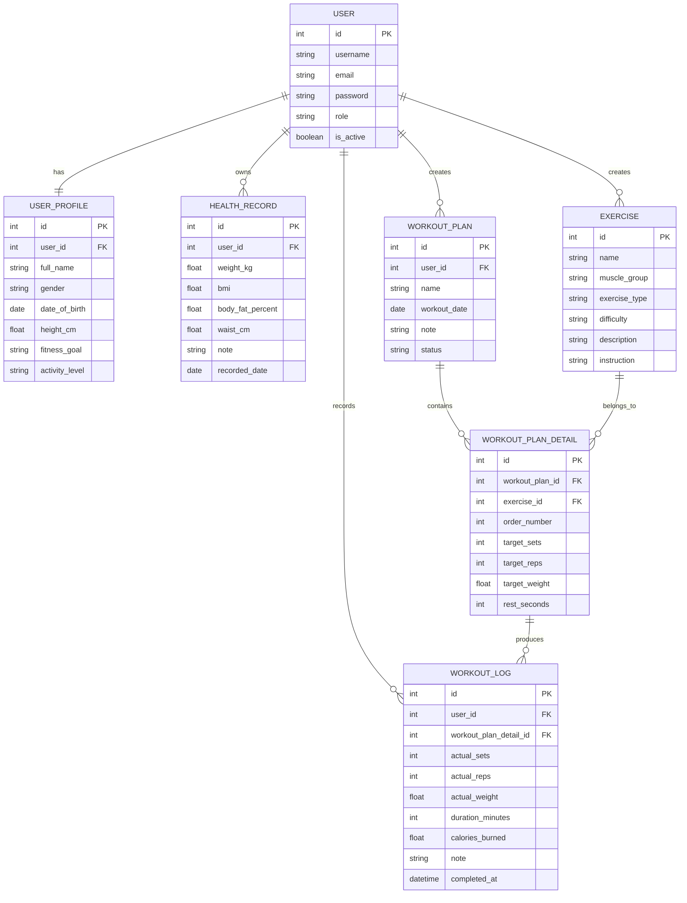

# IE221 – PROJECT CONTEXT FOR CLAUDE

## 1. Thông tin đồ án

- **Môn học:** IE221.F31.CN1.CNTT – Kỹ thuật lập trình Python
- **Giảng viên:** Phạm Thế Sơn
- **Hình thức:** Đồ án môn học
- **Số thành viên:** 01 sinh viên / 01 nhóm
- **Tên đề tài đã chốt:**  
  **HỆ THỐNG QUẢN LÝ LỊCH TẬP VÀ THEO DÕI SỨC KHỎE CÁ NHÂN**
- **Tên kỹ thuật đề xuất khi đăng ký:**  
  **Xây dựng Backend API quản lý lịch tập và theo dõi sức khỏe cá nhân bằng Python Django**
- **Hướng đề tài:** Web Application / Backend API / RESTful API Server.
- **Không yêu cầu frontend.**
- **Công cụ demo chính:** Postman.

---

# 2. Mục tiêu của project

Xây dựng một Backend REST API cho phép người dùng:

1. Đăng ký và đăng nhập.
2. Quản lý hồ sơ cá nhân.
3. Ghi nhận và theo dõi các chỉ số sức khỏe theo thời gian.
4. Xem danh mục bài tập.
5. Tạo và quản lý lịch tập.
6. Thêm bài tập vào từng lịch tập.
7. Ghi nhận kết quả tập thực tế.
8. Theo dõi tiến độ tập luyện.
9. Xem thống kê tổng quan.

Hệ thống có hai vai trò:

- **ADMIN**
- **USER**

Project ưu tiên:
- nghiệp vụ rõ ràng;
- đủ thể hiện Python, OOP, Django, REST API, Database, Authentication, Authorization;
- code dễ hiểu, dễ giải thích khi bảo vệ;
- phù hợp một sinh viên thực hiện;
- không over-engineering.

---

# 3. Các ràng buộc đồ án cần bám

## 3.1. Theo hướng Web API

Hệ thống cần thể hiện:

- API đăng ký.
- API đăng nhập.
- REST API sử dụng các method:
  - GET
  - POST
  - PUT/PATCH
  - DELETE
- API cho các chức năng quan trọng.
- Kiểm thử API bằng Postman.
- Có CSDL.
- Có ít nhất hai loại người dùng.
- Có kiến trúc hệ thống.
- Có sơ đồ chức năng.
- Có thể trình bày MVC/MVT.
- Có kiểm thử.

## 3.2. CSDL

Phạm vi dự kiến:

- Khoảng **5–10 bảng**.
- Project hiện tại chốt **7 bảng chính**.
- Dữ liệu có thể dùng tiếng Việt có dấu.
- Nếu có tiền tệ thì dùng VND, tuy nhiên project này không có nghiệp vụ tiền tệ.

---

# 4. Công nghệ chốt

## Backend

- Python 3.x
- Django
- Django REST Framework
- Simple JWT (`djangorestframework-simplejwt`)

## Database

- SQLite

Lý do chọn SQLite:
- setup nhanh;
- phù hợp đồ án cá nhân;
- không cần cài thêm DB Server;
- Django hỗ trợ trực tiếp;
- đủ để demo và bảo vệ.

## Công cụ

- Postman
- Git
- VS Code / PyCharm đều được

---

# 5. Kiến trúc tổng quát

```text
Postman / API Client
        |
        | HTTP + JSON
        v
Django URL Router
        |
        v
Views / ViewSets
        |
        v
Serializers
        |
        v
Models
        |
        v
SQLite Database
```

Django sử dụng kiến trúc MVT.

Trong project REST API:

- **Model:** quản lý dữ liệu.
- **View/ViewSet:** xử lý request, nghiệp vụ API.
- **Template:** gần như không sử dụng HTML Template.
- **Serializer:** trung gian chuyển đổi Model <-> JSON và validation.

Không cần cố xây frontend chỉ để đủ chữ "View".

---

# 6. Actor

## 6.1. User

Người dùng thông thường.

Có thể:

- Đăng ký.
- Đăng nhập.
- Xem/cập nhật hồ sơ.
- Ghi chỉ số sức khỏe.
- Xem lịch sử sức khỏe.
- Xem bài tập.
- Tìm/lọc bài tập.
- Tạo lịch tập.
- Thêm bài vào lịch.
- Sửa lịch tập.
- Xóa lịch tập.
- Ghi nhận kết quả tập.
- Xem lịch sử tập.
- Xem thống kê cá nhân.

## 6.2. Admin

Có thể:

- Đăng nhập.
- Xem danh sách User.
- Xem chi tiết User.
- Khóa/mở tài khoản.
- Thêm Exercise.
- Sửa Exercise.
- Xóa Exercise.
- Xem dữ liệu hệ thống.

---

# 7. Use Case chính

## User

| Mã | Use Case | Mô tả |
|---|---|---|
| UC01 | Đăng ký | Tạo tài khoản |
| UC02 | Đăng nhập | Xác thực và nhận JWT |
| UC03 | Quản lý hồ sơ | Xem/cập nhật thông tin cá nhân |
| UC04 | Theo dõi sức khỏe | Ghi cân nặng, BMI, body fat, vòng eo |
| UC05 | Xem bài tập | Xem danh sách Exercise |
| UC06 | Xem chi tiết bài tập | Xem mô tả, nhóm cơ, hướng dẫn |
| UC07 | Quản lý lịch tập | Tạo/sửa/xóa WorkoutPlan |
| UC08 | Quản lý bài trong lịch | Thêm/sửa/xóa WorkoutPlanDetail |
| UC09 | Ghi kết quả tập | Ghi WorkoutLog |
| UC10 | Xem lịch sử tập | Xem các buổi đã tập |
| UC11 | Xem thống kê | Xem tiến độ sức khỏe và tập luyện |

## Admin

| Mã | Use Case |
|---|---|
| A01 | Đăng nhập Admin |
| A02 | Xem danh sách User |
| A03 | Khóa/mở User |
| A04 | CRUD Exercise |

---

# 8. Luồng nghiệp vụ chính của User

```text
Đăng ký
   ↓
Đăng nhập
   ↓
Cập nhật hồ sơ cá nhân
   ↓
Ghi chỉ số sức khỏe ban đầu
   ↓
Xem danh sách bài tập
   ↓
Tạo lịch tập
   ↓
Thêm các bài vào lịch
   ↓
Thực hiện buổi tập
   ↓
Ghi kết quả thực tế
   ↓
Đánh dấu lịch tập hoàn thành
   ↓
Ghi lại chỉ số sức khỏe mới
   ↓
Xem thống kê tiến độ
```

Đây là luồng demo chính khi bảo vệ.

---

# 9. Database Design

Project chốt **7 bảng chính**.

---

## 9.1. User

Có thể kế thừa `AbstractUser`.

### Field đề xuất

| Field | Type | Constraint |
|---|---|---|
| id | PK | auto |
| username | varchar | unique, not null |
| email | varchar | unique |
| password | varchar | hashed |
| role | varchar | ADMIN / USER |
| is_active | boolean | default true |
| date_joined | datetime | auto |

### Role

```text
ADMIN
USER
```

---

## 9.2. UserProfile

Thông tin cá nhân tương đối ổn định.

| Field | Type | Constraint |
|---|---|---|
| id | PK | auto |
| user_id | FK -> User | unique |
| full_name | varchar | nullable |
| gender | varchar | nullable |
| date_of_birth | date | nullable |
| height_cm | float | nullable |
| fitness_goal | varchar | nullable |
| activity_level | varchar | nullable |

### Fitness Goal

```text
LOSE_WEIGHT
GAIN_MUSCLE
MAINTAIN
IMPROVE_HEALTH
```

### Activity Level

```text
LOW
MODERATE
HIGH
```

---

## 9.3. HealthRecord

Dữ liệu sức khỏe thay đổi theo thời gian.

| Field | Type | Constraint |
|---|---|---|
| id | PK | auto |
| user_id | FK -> User | not null |
| weight_kg | float | > 0 |
| bmi | float | system calculated |
| body_fat_percent | float | nullable |
| waist_cm | float | nullable |
| note | text | nullable |
| recorded_date | date | not null |
| created_at | datetime | auto |

### Công thức BMI

```text
BMI = weight_kg / (height_m ^ 2)
```

BMI có thể được tính từ:

- `UserProfile.height_cm`
- `HealthRecord.weight_kg`

Không bắt buộc người dùng nhập trực tiếp BMI.

---

## 9.4. Exercise

Danh mục bài tập dùng chung.

| Field | Type | Constraint |
|---|---|---|
| id | PK | auto |
| name | varchar | not null |
| muscle_group | varchar | not null |
| exercise_type | varchar | not null |
| difficulty | varchar | nullable |
| description | text | nullable |
| instruction | text | nullable |
| calories_per_minute | float | nullable |
| created_by | FK -> User | nullable |
| created_at | datetime | auto |

### Muscle Group

```text
CHEST
BACK
LEGS
SHOULDERS
ARMS
CORE
FULL_BODY
CARDIO
```

### Exercise Type

```text
STRENGTH
CARDIO
FLEXIBILITY
RECOVERY
```

### Difficulty

```text
BEGINNER
INTERMEDIATE
ADVANCED
```

---

## 9.5. WorkoutPlan

Đại diện một lịch/buổi tập.

| Field | Type | Constraint |
|---|---|---|
| id | PK | auto |
| user_id | FK -> User | not null |
| name | varchar | not null |
| workout_date | date | not null |
| note | text | nullable |
| status | varchar | default PLANNED |
| created_at | datetime | auto |
| updated_at | datetime | auto |

### Status

```text
PLANNED
COMPLETED
CANCELLED
```

---

## 9.6. WorkoutPlanDetail

Danh sách các Exercise thuộc một WorkoutPlan.

| Field | Type | Constraint |
|---|---|---|
| id | PK | auto |
| workout_plan_id | FK -> WorkoutPlan | not null |
| exercise_id | FK -> Exercise | not null |
| order_number | int | >= 1 |
| target_sets | int | > 0 |
| target_reps | int | > 0 |
| target_weight | float | nullable |
| rest_seconds | int | nullable |

Ví dụ:

```text
Push Day
├── Bench Press: 4 x 10 x 50kg
├── Incline Dumbbell Press: 3 x 12 x 20kg
└── Shoulder Press: 3 x 10 x 15kg
```

---

## 9.7. WorkoutLog

Lưu kết quả tập thực tế.

| Field | Type | Constraint |
|---|---|---|
| id | PK | auto |
| user_id | FK -> User | not null |
| workout_plan_detail_id | FK -> WorkoutPlanDetail | not null |
| actual_sets | int | > 0 |
| actual_reps | int | > 0 |
| actual_weight | float | nullable |
| duration_minutes | int | nullable |
| calories_burned | float | nullable |
| note | text | nullable |
| completed_at | datetime | auto |

Ví dụ:

```text
Kế hoạch:
Bench Press
4 x 10 x 50kg

Thực tế:
4 x 9 x 50kg
```

Mục đích là phân biệt:

- mục tiêu dự kiến;
- kết quả thực tế.

---

# 10. ERD



---

# 11. Quan hệ CSDL

```text
User
 ├── 1 : 1  UserProfile
 ├── 1 : N  HealthRecord
 ├── 1 : N  WorkoutPlan
 ├── 1 : N  WorkoutLog
 └── 1 : N  Exercise (created_by)

WorkoutPlan
 └── 1 : N WorkoutPlanDetail

Exercise
 └── 1 : N WorkoutPlanDetail

WorkoutPlanDetail
 └── 1 : N WorkoutLog
```

---

# 12. Authentication

Dùng JWT.

## Register

```http
POST /api/auth/register/
```

Ví dụ:

```json
{
  "username": "duc",
  "email": "duc@example.com",
  "password": "12345678"
}
```

## Login

```http
POST /api/auth/login/
```

Response:

```json
{
  "access": "JWT_ACCESS_TOKEN",
  "refresh": "JWT_REFRESH_TOKEN"
}
```

Các API cần đăng nhập gửi:

```http
Authorization: Bearer <access_token>
```

---

# 13. API Design

Prefix chung:

```text
/api/
```

---

## 13.1. Authentication

```http
POST /api/auth/register/
POST /api/auth/login/
POST /api/auth/token/refresh/
```

---

## 13.2. Profile

```http
GET /api/profile/
PUT /api/profile/
```

---

## 13.3. Health Record

```http
GET    /api/health-records/
POST   /api/health-records/
GET    /api/health-records/{id}/
PUT    /api/health-records/{id}/
DELETE /api/health-records/{id}/
```

Filter có thể thêm:

```http
GET /api/health-records/?from=2026-09-01&to=2026-10-01
```

---

## 13.4. Exercise

User:

```http
GET /api/exercises/
GET /api/exercises/{id}/
```

Admin:

```http
POST   /api/exercises/
PUT    /api/exercises/{id}/
DELETE /api/exercises/{id}/
```

Filter:

```http
GET /api/exercises/?muscle_group=CHEST
GET /api/exercises/?exercise_type=STRENGTH
GET /api/exercises/?search=press
```

---

## 13.5. WorkoutPlan

```http
GET    /api/workout-plans/
POST   /api/workout-plans/
GET    /api/workout-plans/{id}/
PUT    /api/workout-plans/{id}/
DELETE /api/workout-plans/{id}/
```

Filter:

```http
GET /api/workout-plans/?status=PLANNED
GET /api/workout-plans/?date=2026-10-05
```

---

## 13.6. WorkoutPlanDetail

```http
POST   /api/workout-plans/{plan_id}/exercises/
PUT    /api/workout-plan-details/{id}/
DELETE /api/workout-plan-details/{id}/
```

Có thể thêm:

```http
GET /api/workout-plans/{plan_id}/exercises/
```

---

## 13.7. WorkoutLog

```http
GET  /api/workout-logs/
POST /api/workout-logs/
GET  /api/workout-logs/{id}/
PUT  /api/workout-logs/{id}/
```

Không nhất thiết phải DELETE WorkoutLog nếu muốn giữ lịch sử, nhưng có thể làm để đủ CRUD.

---

## 13.8. Statistics

```http
GET /api/statistics/overview/
GET /api/statistics/weight-progress/
```

Optional:

```http
GET /api/statistics/workout-progress/
```

---

## 13.9. Admin User

```http
GET   /api/admin/users/
GET   /api/admin/users/{id}/
PATCH /api/admin/users/{id}/status/
```

---

# 14. Tổng số API dự kiến

Khoảng:

| Module | Số lượng |
|---|---:|
| Authentication | 3 |
| Profile | 2 |
| HealthRecord | 5 |
| Exercise | 5 |
| WorkoutPlan | 5 |
| WorkoutPlanDetail | 3–4 |
| WorkoutLog | 4 |
| Statistics | 2–3 |
| Admin User | 3 |
| **Tổng** | **~32 API** |

Không bắt buộc phải làm đủ toàn bộ nếu thời gian không cho phép.

Ưu tiên API chạy ổn định hơn số lượng.

Minimum scope nên hoàn thành:

- Auth
- Profile
- HealthRecord
- Exercise
- WorkoutPlan
- WorkoutPlanDetail
- WorkoutLog
- Statistics Overview

---

# 15. Business Rules

## Authentication

### BR01
Username không được trùng.

### BR02
Email không được trùng nếu email được dùng làm định danh.

### BR03
Password phải được hash bằng cơ chế Django.

---

## Permission

### BR04
User chỉ được đọc/sửa dữ liệu của chính mình.

### BR05
User A không được xem WorkoutPlan của User B.

### BR06
Chỉ Admin được CRUD Exercise.

### BR07
Chỉ Admin được xem danh sách toàn bộ User.

---

## Health

### BR08
`weight_kg > 0`.

### BR09
`height_cm > 0`.

### BR10
BMI được hệ thống tính từ chiều cao và cân nặng.

### BR11
User chỉ được tạo HealthRecord cho chính mình.

---

## Workout

### BR12
`target_sets > 0`.

### BR13
`target_reps > 0`.

### BR14
`actual_sets > 0`.

### BR15
`actual_reps > 0`.

### BR16
Weight không được âm.

### BR17
WorkoutPlan chỉ thuộc một User.

### BR18
WorkoutPlanDetail chỉ được thêm vào WorkoutPlan thuộc User hiện tại.

### BR19
WorkoutLog chỉ được ghi cho WorkoutPlanDetail thuộc User hiện tại.

---

# 16. Permission Strategy

Có ba tầng:

```text
IsAuthenticated
      ↓
Role Permission
      ↓
Object Ownership
```

Ví dụ:

```text
GET /api/workout-plans/10/
```

Không chỉ kiểm tra đã login.

Phải kiểm tra:

```python
workout_plan.user == request.user
```

Nếu không đúng:

- trả `404 Not Found`, hoặc
- `403 Forbidden`.

Ưu tiên `404` nếu muốn tránh lộ sự tồn tại của dữ liệu người khác.

---

# 17. Statistics

Đây là nhóm chức năng nên chọn để trình bày là chức năng nổi bật nhất.

## Overview

```http
GET /api/statistics/overview/
```

Ví dụ response:

```json
{
  "total_workouts": 18,
  "completed_workouts": 15,
  "total_training_minutes": 840,
  "starting_weight": 72.0,
  "current_weight": 70.5,
  "weight_change": -1.5,
  "bmi": 24.98
}
```

## Weight Progress

```http
GET /api/statistics/weight-progress/
```

Ví dụ:

```json
[
  {
    "date": "2026-09-01",
    "weight": 72.0
  },
  {
    "date": "2026-09-15",
    "weight": 71.5
  },
  {
    "date": "2026-10-01",
    "weight": 70.5
  }
]
```

---

# 18. Chức năng nổi bật khi bảo vệ

Tên:

**Theo dõi tiến độ tập luyện và sức khỏe cá nhân**

Luồng:

```text
User
 ↓
WorkoutPlan
 ↓
WorkoutPlanDetail
 ↓
WorkoutLog
 ↓
HealthRecord
 ↓
Statistics
```

Thông điệp khi trình bày:

> Hệ thống không chỉ quản lý lịch tập mà còn lưu kết quả tập thực tế và lịch sử chỉ số sức khỏe. Từ dữ liệu đó hệ thống tổng hợp tiến độ của người dùng theo thời gian.

Không nên chọn "CRUD Exercise" làm chức năng nổi bật vì quá cơ bản.

---

# 19. Django App Structure

Chỉ nên tách 3 app.

```text
fitness_api/
│
├── manage.py
├── requirements.txt
├── README.md
├── db.sqlite3
│
├── config/
│   ├── __init__.py
│   ├── settings.py
│   ├── urls.py
│   ├── wsgi.py
│   └── asgi.py
│
├── accounts/
│   ├── models.py
│   ├── serializers.py
│   ├── views.py
│   ├── urls.py
│   ├── permissions.py
│   ├── admin.py
│   └── tests.py
│
├── workouts/
│   ├── models.py
│   ├── serializers.py
│   ├── views.py
│   ├── urls.py
│   ├── permissions.py
│   ├── admin.py
│   └── tests.py
│
└── health/
    ├── models.py
    ├── serializers.py
    ├── views.py
    ├── urls.py
    ├── admin.py
    └── tests.py
```

Mapping:

```text
accounts
├── User
└── UserProfile

workouts
├── Exercise
├── WorkoutPlan
├── WorkoutPlanDetail
└── WorkoutLog

health
└── HealthRecord
```

---

# 20. Coding Principle

Claude cần tuân thủ các nguyên tắc sau khi hỗ trợ project.

## 20.1. Phù hợp sinh viên

Code phải:

- dễ đọc;
- có cấu trúc;
- không quá enterprise;
- không dùng pattern phức tạp nếu không cần;
- không thêm Redis, Celery, Docker, microservice...
- không thêm frontend.

## 20.2. Django REST Framework chuẩn

Ưu tiên dùng:

- Model
- ModelSerializer
- ViewSet / GenericAPIView khi phù hợp
- Permission Class
- Router
- Django ORM

Không tự viết SQL nếu Django ORM xử lý được.

## 20.3. Logic nghiệp vụ

Không nhét toàn bộ logic vào một file.

Tuy nhiên cũng không cần tạo:

```text
repository/
services/
domain/
usecases/
...
```

chỉ để "đẹp kiến trúc".

Project đồ án nên giữ gọn.

## 20.4. Validation

Validation nên đặt tại:

- Model constraint khi phù hợp;
- Serializer validation;
- Permission cho quyền truy cập.

---

# 21. API Response Convention

Không bắt buộc mọi response phải có wrapper phức tạp.

Có thể trả theo chuẩn DRF.

Ví dụ:

```json
{
  "id": 1,
  "name": "Bench Press",
  "muscle_group": "CHEST"
}
```

Error:

```json
{
  "target_sets": [
    "Ensure this value is greater than 0."
  ]
}
```

Không cần xây custom response framework.

---

# 22. HTTP Status cần dùng đúng

| Action | Status |
|---|---|
| GET thành công | 200 |
| POST tạo thành công | 201 |
| DELETE thành công | 204 |
| Validation error | 400 |
| Chưa đăng nhập | 401 |
| Không có quyền | 403 |
| Không tìm thấy | 404 |

---

# 23. Test Cases cần chuẩn bị

## Authentication

| Test | Expected |
|---|---|
| Register hợp lệ | 201 |
| Username trùng | 400 |
| Email trùng | 400 |
| Login đúng | trả JWT |
| Login sai | 401 |

## Profile

| Test | Expected |
|---|---|
| GET profile sau login | 200 |
| PUT profile | dữ liệu cập nhật |
| không token | 401 |

## HealthRecord

| Test | Expected |
|---|---|
| weight hợp lệ | 201 |
| weight âm | 400 |
| BMI được tính | đúng công thức |
| xem record của người khác | 404/403 |

## Exercise

| Test | Expected |
|---|---|
| User GET Exercise | 200 |
| Admin POST Exercise | 201 |
| User POST Exercise | 403 |
| Search Exercise | đúng kết quả |

## WorkoutPlan

| Test | Expected |
|---|---|
| User tạo plan | 201 |
| User xem plan của mình | 200 |
| User xem plan người khác | 404/403 |
| User sửa plan mình | 200 |
| User xóa plan mình | 204 |

## WorkoutLog

| Test | Expected |
|---|---|
| actual_sets > 0 | success |
| actual_sets <= 0 | 400 |
| log bài tập người khác | 403/404 |

---

# 24. Demo Flow

Không demo toàn bộ API rời rạc.

Demo theo một câu chuyện.

## User flow

### 1. Register

```http
POST /api/auth/register/
```

### 2. Login

```http
POST /api/auth/login/
```

Lấy access token.

### 3. Update Profile

```http
PUT /api/profile/
```

### 4. Create HealthRecord

```http
POST /api/health-records/
```

### 5. Get Exercises

```http
GET /api/exercises/
```

### 6. Create WorkoutPlan

```http
POST /api/workout-plans/
```

### 7. Add Exercise to Plan

```http
POST /api/workout-plans/{id}/exercises/
```

### 8. Create WorkoutLog

```http
POST /api/workout-logs/
```

### 9. Complete Workout

Update status:

```text
PLANNED -> COMPLETED
```

### 10. Statistics

```http
GET /api/statistics/overview/
```

## Admin flow

### 11. Login Admin

### 12. Admin Create Exercise

```http
POST /api/exercises/
```

### 13. User thử Create Exercise

Expected:

```text
403 Forbidden
```

Flow này thể hiện:

- Authentication
- Authorization
- Database
- CRUD
- Business Logic
- REST API
- Statistics
- Validation

---

# 25. Sample Data

## Admin

```text
username: admin
role: ADMIN
```

## User

```text
username: duc
role: USER
height: 168 cm
goal: GAIN_MUSCLE
```

## Exercise

```text
Bench Press
Chest
Strength
Intermediate

Squat
Legs
Strength
Intermediate

Plank
Core
Strength
Beginner

Running
Cardio
Cardio
Beginner
```

---

# 26. Ví dụ WorkoutPlan

```text
Name: Push Day
Date: 2026-10-05
Status: PLANNED
```

Chi tiết:

```text
1. Bench Press
   target_sets = 4
   target_reps = 10
   target_weight = 50
   rest_seconds = 90

2. Incline Dumbbell Press
   target_sets = 3
   target_reps = 12
   target_weight = 20
   rest_seconds = 60

3. Shoulder Press
   target_sets = 3
   target_reps = 10
   target_weight = 15
   rest_seconds = 60
```

---

# 27. Ví dụ WorkoutLog

Kế hoạch:

```text
Bench Press
4 x 10 x 50 kg
```

Thực tế:

```text
actual_sets = 4
actual_reps = 9
actual_weight = 50 kg
duration_minutes = 12
```

---

# 28. Scope chính thức

## BẮT BUỘC LÀM

- [ ] Django project
- [ ] Django REST Framework
- [ ] SQLite
- [ ] Custom User hoặc mở rộng Django User
- [ ] Role ADMIN / USER
- [ ] JWT Authentication
- [ ] UserProfile
- [ ] HealthRecord
- [ ] Exercise
- [ ] WorkoutPlan
- [ ] WorkoutPlanDetail
- [ ] WorkoutLog
- [ ] Statistics
- [ ] Permission
- [ ] Validation
- [ ] Postman testing
- [ ] README
- [ ] Báo cáo
- [ ] Slide

## KHÔNG LÀM TRONG VERSION ĐỒ ÁN

- React
- Angular
- Flutter
- React Native
- Mobile App
- AI tạo lịch tập
- OpenAI API
- Chatbot
- Computer Vision
- Chụp thức ăn tính calories
- Apple Health
- Smartwatch
- Social network
- PT online
- Payment
- Notification service
- Microservice
- Redis
- Celery
- Docker/Kubernetes nếu không thật sự cần

---

# 29. Implementation Roadmap

## Phase 1 – Setup

- Tạo virtual environment.
- Cài Django.
- Cài DRF.
- Cài Simple JWT.
- Tạo project.
- Tạo apps:
  - accounts
  - workouts
  - health

## Phase 2 – Authentication

- Custom User.
- Role.
- Register.
- Login JWT.
- Permission.

## Phase 3 – Profile + Health

- UserProfile Model.
- HealthRecord Model.
- CRUD.
- BMI calculation.

## Phase 4 – Exercise

- Exercise Model.
- User read.
- Admin CRUD.
- Search/filter.

## Phase 5 – Workout

- WorkoutPlan.
- WorkoutPlanDetail.
- Ownership validation.
- CRUD.

## Phase 6 – Workout Log

- WorkoutLog.
- Validation.
- Update WorkoutPlan status.

## Phase 7 – Statistics

- Overview.
- Weight progress.
- Optional workout progress.

## Phase 8 – Test

- Django tests cơ bản.
- Postman Collection.
- Kiểm tra permission.
- Kiểm tra validation.

## Phase 9 – Documentation

- ERD.
- Architecture.
- API list.
- Test result.
- README.
- Báo cáo.
- Slide.

---

# 30. Yêu cầu báo cáo

Báo cáo chính nên khoảng:

- tối thiểu 5 trang;
- tối đa 10 trang;

không tính:

- bìa;
- tài liệu tham khảo;
- phụ lục.

Cấu trúc đề xuất:

```text
1. GIỚI THIỆU

2. MÔ TẢ CƠ SỞ DỮ LIỆU
   2.1. Sơ đồ ERD
   2.2. Mô tả các bảng

3. PHÂN TÍCH CHỨC NĂNG
   3.1. Actor
   3.2. User Use Case
   3.3. Admin Use Case
   3.4. REST API

4. THIẾT KẾ HỆ THỐNG
   4.1. Kiến trúc hệ thống
   4.2. Django MVT
   4.3. Luồng xử lý API
   4.4. Phân quyền

5. KIỂM THỬ
   5.1. Postman
   5.2. Authentication
   5.3. Permission
   5.4. Validation

6. KẾT LUẬN
```

## Chú ý

- Không đưa nhiều code vào nội dung chính.
- Code nếu cần để ở phụ lục.
- Screenshot sản phẩm/API nên ưu tiên phần phụ lục.
- Trước một hình cần có câu dẫn.
- Sau hình cần giải thích ý nghĩa.
- Không đưa hình chỉ để trang trí.
- Phần Giới thiệu nên khoảng nửa trang, 2 đoạn.
- Kết luận tập trung:
  - kết quả đạt được;
  - chức năng hài lòng nhất;
  - hạn chế.
- Không cần viết "hướng phát triển" nếu template không yêu cầu.

---

# 31. Slide

Khoảng 8–9 slide.

```text
Slide 1 – Tên đề tài

Slide 2 – Giới thiệu
- Bài toán
- Công nghệ
- Kết quả

Slide 3 – Chức năng hệ thống
- User
- Admin

Slide 4 – ERD

Slide 5 – Kiến trúc hệ thống

Slide 6 – REST API

Slide 7 – Chức năng nổi bật
- Workout tracking
- Health tracking
- Statistics

Slide 8 – Kiểm thử

Slide 9 – Kết luận
```

Thời gian hướng đến:

```text
Thuyết trình: ~8 phút
Demo: ~8 phút
```

---

# 32. Sản phẩm cuối

Chuẩn bị:

```text
NhomXX_Bao_cao.docx
NhomXX_Bao_cao.pdf

NhomXX_Slide.pptx
NhomXX_Slide.pdf

NhomXX_Code
```

Nếu lớp thuộc hệ yêu cầu video:

```text
NhomXX_Video.mp4
```

Không nén toàn bộ thành một file nếu yêu cầu nộp riêng.

---

# 33. Hướng dẫn Claude khi hỗ trợ project

Khi nhận file này làm context, Claude cần tuân thủ:

## 33.1. Không tự ý đổi scope

Không tự thêm:

- frontend;
- AI;
- microservice;
- Docker;
- Redis;
- Celery;
- payment;
- notification;
- social features.

Nếu thấy cần thêm tính năng mới, phải giải thích trước.

---

## 33.2. Ưu tiên hoàn thành project

Thứ tự ưu tiên:

```text
Correctness
    >
Đơn giản
    >
Dễ hiểu
    >
Dễ demo
    >
Kiến trúc đẹp
```

Không ưu tiên enterprise architecture.

---

## 33.3. Khi sinh code

Mỗi lần code cần:

1. Nói file nào tạo/sửa.
2. Không sửa file không liên quan.
3. Giữ code ngắn, rõ.
4. Không thêm dependency khi không cần.
5. Nếu thêm dependency phải cập nhật `requirements.txt`.
6. Giải thích migration nếu thay Model.
7. Đưa command cần chạy.
8. Cho request Postman để kiểm tra.
9. Nêu Expected Response.
10. Không giả định code đang chạy nếu chưa test.

---

## 33.4. Khi debug

Quy trình:

```text
1. Đọc error/log.
2. Xác định lỗi.
3. Trace đúng file.
4. Đề xuất fix nhỏ nhất.
5. Không refactor lan man.
6. Kiểm tra lại API bị ảnh hưởng.
```

---

## 33.5. Khi thiết kế API

Luôn kiểm tra:

- Authentication?
- Permission?
- Ownership?
- Validation?
- HTTP Status?
- Serializer?
- Foreign Key?
- User có thể truy cập dữ liệu người khác không?

---

## 33.6. Khi thiết kế Model

Không thay đổi 7 bảng cốt lõi nếu không có lý do rõ.

7 bảng:

```text
User
UserProfile
HealthRecord
Exercise
WorkoutPlan
WorkoutPlanDetail
WorkoutLog
```

Nếu cần thêm field thì ưu tiên thêm vào bảng hiện có thay vì tạo bảng mới.

---

# 34. Definition of Done

Project được xem là hoàn thành khi:

## Backend

- [ ] server chạy được;
- [ ] migration không lỗi;
- [ ] register được;
- [ ] login JWT được;
- [ ] role hoạt động;
- [ ] permission hoạt động;
- [ ] UserProfile hoạt động;
- [ ] HealthRecord CRUD hoạt động;
- [ ] Exercise API hoạt động;
- [ ] Admin CRUD Exercise hoạt động;
- [ ] WorkoutPlan CRUD hoạt động;
- [ ] thêm bài vào WorkoutPlan được;
- [ ] WorkoutLog hoạt động;
- [ ] Statistics trả dữ liệu đúng.

## Security / Permission

- [ ] User A không xem dữ liệu User B.
- [ ] User thường không CRUD Exercise.
- [ ] API protected trả 401 khi không login.

## Testing

- [ ] Có Postman Collection.
- [ ] Có dữ liệu demo.
- [ ] Có test case Authentication.
- [ ] Có test case Permission.
- [ ] Có test case Validation.

## Documentation

- [ ] README.
- [ ] ERD.
- [ ] Architecture.
- [ ] API List.
- [ ] Báo cáo DOCX/PDF.
- [ ] Slide PPTX/PDF.

---

# 35. Prompt khởi đầu đề xuất cho Claude

Có thể dùng ngay:

```text
Bạn đang hỗ trợ tôi làm đồ án môn IE221 – Kỹ thuật lập trình Python.

Hãy đọc toàn bộ file PROJECT_CONTEXT.md trước khi làm.

Các quyết định về đề tài, scope, database, architecture và API trong file này được xem là baseline của project.

Nguyên tắc:
- Không tự mở rộng scope.
- Không làm frontend.
- Backend dùng Python Django + Django REST Framework + SQLite + JWT.
- Project chỉ có 1 sinh viên nên ưu tiên đơn giản, dễ hiểu, dễ demo.
- Không over-engineer.
- Mỗi lần sửa code cần nói rõ file nào sửa, mục đích, command cần chạy và cách test Postman.
- Khi có xung đột giữa giải pháp kỹ thuật phức tạp và giải pháp đủ tốt cho đồ án, ưu tiên giải pháp đơn giản nhưng đúng.
- Giữ đúng 7 model cốt lõi trừ khi tôi đồng ý thay đổi.

Bây giờ hãy bắt đầu từ Phase 1:
1. Đề xuất cấu trúc project.
2. Liệt kê dependency tối thiểu.
3. Tạo Django project và 3 app accounts, workouts, health.
4. Sau đó dừng lại để tôi kiểm tra trước khi tiếp tục.
```

---

# 36. Quyết định hiện tại được xem là CHỐT

```text
Tên đề tài:
Hệ thống quản lý lịch tập và theo dõi sức khỏe cá nhân

Loại project:
Backend REST API

Language:
Python

Framework:
Django + Django REST Framework

Database:
SQLite

Authentication:
JWT

Roles:
ADMIN / USER

Core models:
7

Frontend:
Không làm

Demo:
Postman

Main feature:
Theo dõi tiến độ tập luyện và sức khỏe

Implementation style:
Đơn giản, rõ ràng, phù hợp đồ án sinh viên.
```

---

# 37. Ghi chú cuối cho Claude

Không cần cố biến project thành một sản phẩm thương mại hoàn chỉnh.

Mục tiêu của đồ án là chứng minh sinh viên hiểu và vận dụng được:

```text
Python
OOP
Django
Django REST Framework
Database
ORM
Authentication
Authorization
REST API
Validation
Business Logic
Testing
System Design
```

Nếu một tính năng không giúp thể hiện rõ một trong các nội dung trên thì không ưu tiên thực hiện.

